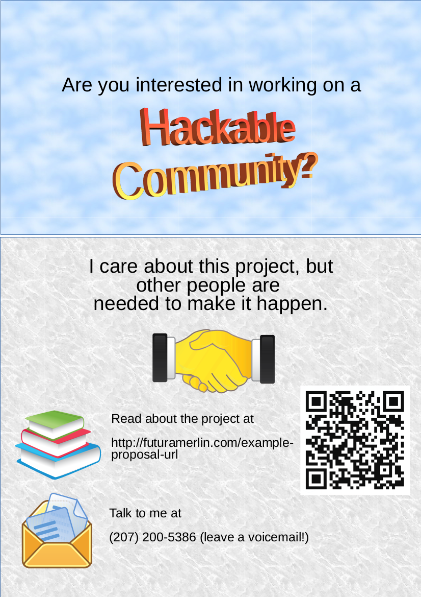

The structure of this document is based on "Text-based project proposal: Template" (http://jonippolito.net/teaching/capstone/text_proposal_template.html).

Note that the structure is slightly different than in the template, to present the most relevant and accessible information first, with lengthier and more abstruse sections placed later. This proposal incorporates some earlier writings on the project.

Title (working title): Community Resources Development Project

Human connections will be critical for the success of this project. If you're interested on working on a hackable community, please contact me! I can be reached at (207) 200-5386 (please leave a voicemail). Thanks!

# Abstract

This proposal introduces a project to develop and facilitate collaboration on a specification, a library, and a model community, to serve as resources and infrastructure for innovative communities.

# The problem

There is no project that is successfully systematically supporting the libre development and distribution as best as possible of the full set of knowledge and resources needed to support humans' standard of living. "Libre" refers to the ethical principle of freedom of knowledge, whereby knowledge is provided with the legal protection of rights such as modification and redistribution. (For specifics on this project's goals and strategies in libre licensing, see the "Licensing" section below.)

There is also no project that is successfully ensuring the availability of communities managed in the long-term interest of their constituents, humanity, and the environment. This results in human suffering and inequality (for instance, the dramatic disparities in income between race, gender, and economic groups), catastrophic cultural and historical loss (for instance, as in the loss of the National Museum of Brazil), and prolonged global ecological crises (for instance, deforestation and climate change) caused by government and corporate apathy and abuse.

These problems are not hypothetical. They are very real and ongoing problems, and are actively causing very real and ongoing harm.

## Evidence of the problem

For an annotated reading list of evidence supporting the presence of some of the issues this project tackles, see the "Evidence of the problem" section of the bibliography at the end of this proposal.

## Existing work towards solving this problem

Many existing projects address various aspects of the issues this project addresses. None seems to cohesively aim to integrate these aspects into a comprehensive libre framework and model implementation, though, driving the need for this project. For an annotated list of related projects and inspirations to this project, see the "Related projects and inspirations" section of the bibliography at the end of this proposal.

# General approach

This project should aim to systematically support the libre development and distribution as best as possible of the full set of knowledge and resources needed to support humans' standard of living, and to ensure the availability of communities managed in the long-term interest of their constituents, humanity, and the environment. The communities should attempt to provide a consistent and complete experience to the people who are part of them, without depending on support from external infrastructure, technology, or government. Relying on external support increases fragility.

This is a multifaceted project to develop a scalable environment for building an effective, just, and efficient society; consequently, it is quite broad in scope. To organize the broad scope of this project, it is currently divided into three primary areas of work: 
- A specification of principles and methods on which the project is based
- A community and a non-profit organization to manage and implement the project
- A library of knowledge and great cultural works

# Expected outcomes

## Project bootstrapping

The chief problems for the project right now are communication (helping people understand what the project is, and what needs to be done on it) and collaboration (getting people on board with it). Resolving those issues should really be the first order of business for me, and probably should be my focus for this semester.

## Overall project

- Project objectives completed
  - Support and ongoing development of the project's intellectual deliverables, all of which (with the exceptions of parts 2 and 3 of the library) should be libre-licensed
    - Specifications
      - Philosophy and rationale
      - Community
      - Technology and engineering
      - Goods and services
    - Library of knowledge and great cultural works
  - A self-sustaining financially, technologically, and resource-independent community and a non-profit organization to manage and implement the project, and to serve as a model for other communities using this strategy
  - Distribution of the knowledge assets, allowing a decentralized network of communities using these specifications

# Tasks list

## Planning and strategy
- The most important tasks are also the most difficult. Developing assets (specifications, etc.) is trivial compared to developing communication skills and establishing allies.
- My role in this project should be to coordinate and facilitate until a person or persons more capable is/are available, and/or until it is self-managed, and my presence or absence would have no appreciable effect on it.

## People and communication
- Establish connections with people. Human connections will be critical for the success of this project.
- Develop effective communication skills and strategies. Without being able to get allies in developing the project, it would be dead in the water.
  - That means being able to express clearly, succinctly, and persuasively the following (at least): _what_ this project is, _why_ it is important and achievable, and _how_ to help with it.
  - This includes both in writing and in person. Improving my in-person communication skills is especially important (my in-person speaking on this project is disastrously bad).

## Finances, budget, and stability
- Finances: Develop a financial strategy and budget requirements.
- While the project still has a bus factor of 1, my personal stability is critical for the project. Barring exceptional circumstances, I should be able to continue working on it through graduation thanks to the university and government's student financial aid, and my family's financial support.
- Significant volunteer involvement and/or external investment will be necessary for a full implementation of this project.

## Steps dependent on interpersonal connections
- Establish the physical community. This will require initial capital of *at least* tens of thousands of US dollars, as well as support for ongoing expenses.
- Create a non-profit organization to manage and be responsible for the project
- Ensure that organization's financial stability (through sources such as an endowment and grants)
- Transfer control of the project's assets to that organization

## Development

These tasks are much less important than the above, but are much easier and comprehensible for me. Consequently, this is where most of my work so far has been.

- Develop, write, test, and document specifications
  - Community governance specifications
  - Technology information and specifications (engineering, construction, etc.), without dependencies (enough information should be included to enable full construction of all technologies starting from nature, without any existing knowledge or technology/machinery; this should be _tested_)
- Write/compile the library
  - Write, compile, and organize content for part 1 of the library
    - Specifications (from above)
    - Subject area information (history, mathematics, linguistics, engineering, etc.)
  - Continue compiling part 2 of the library

# Resources needed

- Communication skills
- Strategic planning
- Team-building skills
- Financial support
- Time
- Stability
  - Financial
  - Personal (finances; energy and focus; time availability)
  - Organizational

# Features of the proposed solution, in detail

## Design principles

These design goals are present to attempt to prevent regressions in the availability and utility of the project.

- Buildable: All technologies and materials needed to build, use, and disassemble the design must also meet these design requirements, and must be fully specified in this document, with reference within the design to those other design specifications, so that every design listed here can be built, used, and disassembled without any knowledge outside of this document, beginning with only the materials available naturally.
- Deconstructable: The design should be able to be disassembled and/or reassembled without any damage or loss to the materials used.
- Materials: All materials needed to build and use a design should be:
  - readily available (not rare or geographically restricted)
  - in a form that can be efficiently returned to a natural state if desired at the end of their lifespan (many plastics, for instance, would fail this criterion unless an energy-efficient tool for reversing their creation is available)
  - all technologies needed for their sourcing, processing, and end-of-life processing must meet these requirements
  - in a form that will return to a natural material over time (the goal of this rule is to avoid materials that result in nonbiodegradeable litter like the microparticles that synthetic textiles sometimes produce; it could probably be better expressed)
- Rugged: All item designs should be long-lasting (not disposable, able to function for many years), rugged, and able to function in adverse conditions.
- Safe: All designs should be safe to build, use, disassemble, and biodegrade.
- Reliable: All designs should work predictably and reliably.
- Libre: The designs should follow the principles needed to ensure they are freely usable, drafted here under "Licensing".
  - Any external dependencies of the project should be libre, so they can be forked and maintained if necessary.
- Incremental: This project should be attempted in an incremental, scalable manner, rather than creating a complex system that would need to be implemented all at once to be effective. That way, small improvements can be made without attempting the insurmountable task of improving larger components of society at once. This incremental development would also allow using the strengths of other current and future projects and systems, and collaborating with and complementing them more effectively.

### Licensing

Aside from sections 2 and 3 of the Ember Library, all portions of the Ember project should be compliant with the Ember Freedom Requirements, and all portions of the project original to Ember should be compliant with the Ember Freedom Requirements. (By their nature, sections 2 and 3 of the library cannot practically be fully libre at present; see the "Library" section of the proposal for further information and rationale.) This is likely not yet a legally effective license, due to a lack of available legal expertise to work on it, and consequently, most of the Ember project and its ancillary projects are licensed under the GNU Affero GPL, version 3 (see the licensing information in each individual repository for details). The term "Information", in these requirements, refers to things such as music, visual art, patents and inventions, specifications, schematics for equipment, etc.

#### Rationale

These licensing requirements are present to attempt to prevent regressions in the availability and utility of the Ember project.

#### Ember Minimal Freedom Requirements (EMFR)

For given Information to be compliant with this standard, the following must be true of it:

- Self-contained: All information necessary for the full and complete use of the Information must also be EMFR-compliant.
- Redistributable: The Information must be legally redistributable.
- Source included: The preferred form for editing the Information must be available and EMFR-compliant; when used by Ember or when presented as EMFR-compliant, if the Information is in a form that is not the preferred form for editing it, a copy of the Information in the preferred form for editing it must always be included with the other copy.
- Notice of terms: When used by Ember or when presented as EMFR-compliant, documentation of these requirements must be provided with all copies of the Information.
- Irrevocable: The restrictions on the Information that make it EMFR-compliant must be irrevocable, at least until it falls into the public domain by legal necessity.
- Unencumbered and unencumbering: The Information may not employ any means to prevent or hinder copying or using it freely; furthermore, if the Information enables access to information that employs such means, the Information must not be complicit in facilitating those restrictions.

#### Ember Freedom Requirements (EFR)

This is the same as the Ember Minimal Freedom Requirements, with the following additional restrictions:

- Requiring non-misleading attribution: Attribution to the source of the Information must be required; if the Information is a derivative work, it must be made clear that it has been modified from the source information.
- Editable: It must be legal to modify the Information, and to redistribute both modified and/or unmodified copies of the Information.
- Mandatory publication: The Information must be promptly published and made widely available publicly at the cost of distribution or less.
- Copyleft: These requirements must be required to apply to all derivative works of the Information, and must be required to apply to all information packaged with the Information.
- Inherited: New information created using the Information must be EMFR-compliant.
- Provision as a service: When the Information is provided as a service, the Information must be made readily available to those who access the service, and documentation of these requirements must be provided with the service.
- Notice of terms: Documentation of these requirements must be provided with all copies of the Information.
- Restricted use: The Information may not itself be used as or as part of advertising or propaganda without the agreement of its creator or creators, although it may be used as a tool for the creation of advertising or propaganda.
- Irrevocable: The restrictions on the Information that make it EFR-compliant must be irrevocable, at least until it falls into the public domain by legal necessity.

## Goals

An Ember community should provide useful elements of survival: shelter, nutrition (including food and water), medical care, education, and information. It would do this as its fulfillment of its objective of managing the various needs of a society, by enabling people to be effective participants in that society.

One role of Ember would be to provide goods. For this, it would be ideal for Ember to control as much of the supply chain as possible. That would allow efficient provision of the goods such as to reduce cost and ensure quality. That control of the supply chain would, in an ideal scenario, extend to all stages of the process, from production of the raw materials to component production to assembly to distribution, as well as shipping at all stages of the process. If Ember both controlled production of raw materials in a region and was the dominant institution working to ensure that those resources are used responsibly, it would of course be important to take the interest Ember has in using the resources sustainably into consideration.

There should be a universally and easily accessible facility to allow the community to vote easily, with systems in place to prevent voter suppression or intimidation.

## Rationale

Human society is sometimes unpredictable in the rights and safeties it affords. Consequently, a unified institution with the aim of remedying these issues should be established outside of the realms of traditional governmental structures. Participation in Ember communities shall be dependent on agreement to specified terms, to best protect the rights of the individuals making up the community.

## Specification document

The most significant knowledge assets of the project should comprise a book, which is equivalent to part 1 of the library, with the information technology environment implementation and part 2 of the library provided with it. That could take the form of a physical printed book, or other document format. It should include specifications of the project philosophy and rationale, community, technology and engineering, and goods and services, as well as a carefully prepared compilation of other important knowledge.

## Designs

The Ember project should develop designs for things such as clothing, tools, and housing. Any finished design provided by the project should conform to some specific traits.

## Community

An Ember community is a group of individuals who have chosen to create an Ember community, and to live in accordance with shared principles so as to best protect individuals' rights.

This organization should not impose restrictions on those who chose to become its members apart from those necessary for the protection of their rights, and anyone should be able to choose to become a part of it or to leave it at any time. Joining the organization would involve being listed in a membership file, presumably with sufficient biometric data (photograph, fingerprints, etc.) to prevent identity theft or other fraudulent activity. Names, addresses, or other such personal information, beyond the biometric data previously mentioned, would not be required for the process of becoming a member. Members are not obligated to use any of the services provided by Ember, and could request at any time the termination of any services presently provided to them. In consideration of the "right to die" debate, perhaps people should be able to (revocably, of course, and only if they can give meaningful consent) even request termination of the basic protection of their human rights such as emergency medical care that any community should by default provide as best as possible to anyone regardless of affiliation.

There are many other concerns relevant to the management of a community, as well; a thorough assessment and consideration of management and governance principles and relevant historical experience would be a prerequisite for the development of the community proposed here.

## Services collective

This proposal advocates the creation of a project to develop an adequate infrastructure for managing and providing for the basic needs of society. This organization could exist alongside governments and other social structures, as well as potentially taking their place in the event that they collapse or fail to perform as expected.

Humans have come to expect and rely upon social constructs for their safety and mutual benefit, but human society is sometimes unpredictable in the rights and safeties it affords. Consequently, there is a need for a unified institution to be established outside of the realms of traditional governmental structures to provide some semblance of a filling of this void. The general rules of this organization should be established on the basis of rights: rather than making a rule that, for example, prohibits murder, instead a rule should be established that protects individuals’ right to life. In such a way, rules would not be created that infringe freedom more than that which is necessary to retain order in society.

An Ember community's services collective is a not-for-profit that organizes the procurement and distribution of goods and services for its members, and perhaps others as well. The goal of this organization would be to provide any needful things desired by its members for their lives. For instance, if a person chose to receive food through Ember, they could request that it be provided in exchange for labor. Their labor would help contribute to services requested in the future by them or other Ember members. The organization should have 24/7 available buildings staffed by Ember members from whom aid could be sought, such as the furnishing of meals, shelter, clothing, access to information, or other services, in exchange for labor. That way, if an Ember member is in trouble in an unfamiliar town, for instance, with no money, identification (beyond their own body), or other resources, they could go to the local Ember building to receive any services they desire; they could even build up credit in preparation for such an incident by working for the Ember collective prior to taking a trip, for instance, so they would have already earned any services they might want (thus acting as travel insurance, in a sense).

A self-contained automated crop growing system could be constructed that would accept a seed as input and produce crops and more seed as output. This could be used for easily growing many types of plant, by providing different growing instructions and seeds as needed. It could also be built in a way that tries to use energy from the environment efficiently, and avoid excessive use of mains power. This would be helpful in simplifying access to plant products, even plants that are not commonly available easily. This principle could be applied to goods in general, using production on demand to reduce waste and transportation and storage costs. Such a system would require a level of technology that will likely take a while to develop without proprietary dependencies.

## Library

The library is divided into three sections, each increasingly broad in scope. Sections 2 and 3 are the only parts of the project that are not fully libre-licensed, due to the inclusion of non-libre-licensed third-party-owned contents in the libraries. The inclusion of some non-libre contents is justified in these cases because of their cultural and historic importance, because they are not dependencies of any other parts of the project, and in the general interest of preserving knowledge. The non-libre contents should of course not be relied upon outside of their role as cultural knowledge artifacts.

## Library Section 1: Basic knowledge, to be included in the text of the project specification

This section of the library will require research and writing. It should consist of many short sections, each covering a topic. Each of these sections should list all other sections that must be understood as prerequisites for understanding it. Ideally, the dependency tree of every section should culminate in a single section that gives a basic understanding of the dominant language of the reference (probably English, for the forseeable future), so that by translating that one section into another language, every other concept in the reference can be understood by reading its section and its section's prerequisites.

It should include specifications of the project philosophy and rationale, community, technology and engineering, and goods and services.

## Library Section 2: Great cultural works

Work has begun on compiling this section of the library, but its utility is restricted by many relevant assets being under copyright but not libre-licensed.

## Library Section 3: Other knowledge, as practical

# Alignment of the project approach to the traits of the currently emerging new media

Henry Jenkins's article "Eight Traits of the New Media Landscape" provides eight traits that its author observes in the prominent currently emerging new media. This section of the proposal evaluates this project's expression of this set of traits.

The first of these traits is _innovation_. This project proposal is arguably merely an extension and refinement of existing systems, and so may not be considered true innovation, depending on perspective. Even in that case, however, because those existing systems are themselves innovative, this project remains a work within new media, even if it is not itself a new medium.

The second trait is _convergence_. This proposal is highly convergent, being a broadly scoped project to innovate across a wide range of aspects of society, industry, and technology.

The third defining trait is _everyday_ presence. As a project to develop a unified system providing all the knowledge resources needed for running a society, if it is successfully completed and used to its envisioned potential, it would be able to serve as the framework for people's everyday lives.

The fourth trait is _appropriation_. This proposed project ideally will be highly appropriative, because so much work has already been done. It would in all probability be hugely wasteful and impractical to attempt to build everything from scratch, rather than to leverage existing systems (even if only practical through inspiration!) and merely work to fill gaps and integrate the various existing technologies well. That said, reliance on proprietary or externally managed technologies should be eliminated as soon as practical, with all elements of the project and its dependencies being fully libre, because proprietary, non-maintainable, and trade-dependent systems are brittle and are a huge threat to the ability of human society to maintain its standards of living over time. Any external dependencies of the project should be libre, so they can be forked and maintained if necessary.

The fifth trait is _networkedness_. As a design goal for this project, networking should be provided when available, but never mandatory. Systems that depend entirely on networking are, echoing the discussion of the fourth point, brittle. Once constructed, the best tools would be fully usable in a vacuum.

The sixth trait is being _global_. The proposed project is intended to be able to be geographically dispersed, although individual communities would only be able to collaborate on physical projects by being physically colocated, for obvious reasons.

The seventh trait is _generational_. Whether an age gap will affect this project is hard to predict. If it does, it should only be by the choice of individuals, rather than by inaccessibility or prejudice: if people who are a different age than the majority involved in the project, those people should be provided any necessary accommodations to the fullest extent possible (medical care for the elderly, education for the young, and so on).

The eighth trait is _inequality_. Unfortunately, this likely may affect the project initially, because a community would presumably be unable to sufficiently support individuals with some disabilities to modern standards until it was somewhat technologically sophisticated, meaning that people involved in the project would need to be able to provide for themselves and (for the physical community or communities) provide transportation for access, restricting practical use of the project to those who are wealthy or otherwise supported. Working to reduce undesired inequality as much as possible should be a design goal of the project, while promoting diversity and freedom.

# Promotion strategy

Based on the "Viral Media Campaign Planner" questionnaire (http://tutorials.nmdprojects.net/plan_viral_campaign/).

## Circulation

Where will you be distributing your meme?

### Immersion

I should learn to speak about the project so I can explain it in person, and learn to be friends with people in general.

## Standing

What credibility do you have for spreading your meme?

### Face-to-face community

I would like to use the advantages provided by the University environment during this last year of my attendance to connect with people interested in this project. I am currently the only person working on the project, although I have talked about it briefly in the context of class presentations, and have discussed it a bit with a few professors.

### Influencers

I hope to connect with people who have skill communicating and connecting with other people who would be interested in the project. I am currently the only person working on the project.

## Manual Vector

How will you inject your meme?

These options, particularly those that seem non-obvious in their implementation, deserve further research and consideration.

### Clothing

This would be possible, pretty much being a walking poster. It probably would cost a large amount of money to get a professional looking customized shirt, though, and a hand-made one would not necessarily be very convincing.

### Flashmob

There would need to be more people. A single-person flashmob wouldn't be particularly visible.

### Launch event

I don't know how to do this, or what it would involve. It sounds expensive, complicated, and liable to have no one show up....

### Postcards

These could possibly be useful as a way to communicate with people working on the project if they are far away. Until there are distant people, though, they wouldn't be worth the cost (it's expensive to print and mail, and each postcard presumably only would reach a few people, unlike a poster).

### Posters

I have designed a poster to help promote this project.

### Stickers

Stickers could be funded and made. There is a risk that they could become litter or used as vandalism, though, which could harm the project, rather than promote it.

## Payload

What's the smallest unit of meaning you hope to circulate?

### Article

This proposal could be polished and published.

## Recognition

How will you measure success?

There are two primary success metrics for this semester. One is the progress I make on a prototype and strategy development; another is how many other people I can convince to work on the project with me.

### Money

People with money may become interested in investing it in this project. If so, any contributions and expenditures should be tracked carefully, with the information publicly available to ensure that contributions are used efficiently. Only my personal funds are used at present.

### Credibility (Diggs/Karma)

As an undergraduate student with good grades, I have a moderate but fairly low amount of credibility. My lack of work experience in related fields may affect that as well. (My résumé is available publicly, which can help people evaluate my experience, giving me more credibility.)

### Reader comments

People communicating with me to join forces on working on this project is the primary quantifiable metric of success for this semester, I think.

# Annotated bibliography

## Evidence of the problem
- "Deforestation" (https://en.wikipedia.org/wiki/Deforestation). In _Wikipedia_. Deforestation is one highly visible illustration of the damage done by short-term, profit-driven decisionmaking.
- "National Museum of Brazil fire" (https://en.wikipedia.org/wiki/National_Museum_of_Brazil_fire). In _Wikipedia_. This fire exemplifies how organizational apathy to cultural preservation can cause devastating losses.
- Economic inequality (https://en.wikipedia.org/wiki/Economic_inequality), often correlating with race and gender, arising regardless of individuals' capacity for economic contribution to society, reduces opportunities for social equality or justice.
- The practice of "wiping" (https://en.wikipedia.org/wiki/Wiping; https://en.wikipedia.org/wiki/Doctor_Who_missing_episodes) historic broadcast media (radio and television) shows is illustrative of popular attitudes towards historical preservation: when value is not recognized at a given moment, things are wantonly neglected or destroyed without regard for what value they may hold in the future. Similarly, many films are lost, especially those that were stored using fragile and flammable nitrocellulose film, in the absence of comprehensive systems in place to ensure their preservation (https://en.wikipedia.org/wiki/Film_preservation; https://en.wikipedia.org/wiki/Lost_film; https://en.wikipedia.org/wiki/Nitrocellulose#Film).

## Related projects and inspirations
- Open Source Ecology (https://www.opensourceecology.org/) is developing, under a libre license, the technologies needed to construct a society. These are resources that are very useful to developing this project.
- The Long Now Foundation (http://longnow.org/) promotes long-term thinking, which is an important design and ethics principle of this project.
- Arch Mission (https://archmission.org/) is compiling libraries of culturally important knowledge, similar to those proposed in this project.
- The United States of America (https://www.usa.gov/) was created as an innovative community on a very large scale. The history of the successes and challenges it and other countries and communities have faced are valuable experiences to learn from when designing organizational management and governance principles.
- Bibliotheca Alexandrina (http://bibalex.org/) preserves and provides access to a wide range of knowledge.
- Bangor Public Library (https://www.bpl.lib.me.us/) provided an environment that stimulated my interest in libraries when I was younger, both in their roles as guardians of knowledge and memory and as social spaces offering resources and a place to go to the public, especially people who are poor, lonely, or otherwise vulnerable or in need. This project incorporates both of those principles, as well as sharing the structure of a resource maintained by and for a community.
